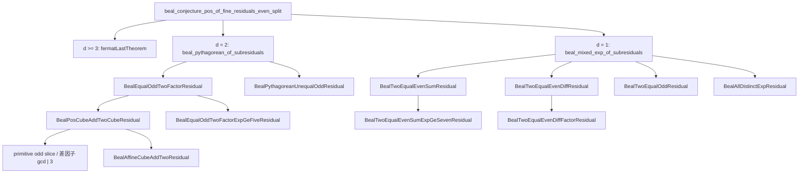

# DstDiophantine 研究優先度ランキング

調査日: 2026-09-20（前回 2026-09-19 からの更新）。基準は Lean 実装（論文草稿と食い違う場合は **Lean が正**）。`sorry` / `admit` による穴はなく、未完了は名前付き `Prop`（Residual / Bridge）と明示 `axiom` 4 本で管理されている。

この文書は「比較的容易に研究が進みそうな部分」を、主要定理への寄与と切り分けて評価したものである。有限 `native_decide` 証書や回帰整備は着手しやすいが、それだけでは live residual は閉じない。

前回 Phase I（立方の局所表・Generators 内部括弧・Motor 回帰）は **着地済み**。残っているのは残差本体と、幾何補題を加法条件へ繋ぐ橋である。

---

## 1. 結論

**次の一手として最も費用対効果が高いのは、`BealPosCubeAddTwoCubeResidual` の立方差 3-descent（`gcd | 3` の場合分け）である。** 局所表・2-adic 原始スライス・差因子パッケージは既に揃っており、Mordell rank を待たずに `d = 2` equal-odd の `e = 3` 枝を前進できる。

同点級の基盤作業だった Generators 内部括弧表と Lorentz スパン閉包は完了した。代数側の次は、着地した sandwich / 干渉 API を使って `FermatMixedMotorResidual` を加法条件へ繋ぐことである。

使い分け:

| 目的 | 着手すべき候補 | 総合順位 |
| --- | --- | ---: |
| Beal の正値組立を 1 葉でも前進させる | cube 立方差 3-descent | 1 |
| `d = 1` even の半分 | even-diff の `n = 4` / opposite-parity no-go | 4 |
| 低リスクの並行作業 | FoundationRegression / 有限証書 | 2–3 |
| FLT の live 経路 | `FermatMixedMotorResidual`（幾何補題は着地、加法条件は未接続） | 6 |
| 避ける（短期） | 旧 coarse / single-axis bridge の再利用、Mordell rank、axiom の内部証明、Goldbach 高さモデル、Faraday と \(u\) の同一視、`𝔰𝔬(3,1)` 抽象同型 | 下位 |

総合 1 位は「容易さだけ」でも「価値だけ」でもなく、**既存補題が厚く、組立先が証明済みで、外部大定理に依存しない**点で選んでいる。2–3 位は Quick Win が高くても残差を閉じない。

---

## 2. 評価法

各候補を 1–5 点で採点し、次の重みで総合点（最大 80）を出す。

| 軸 | 略号 | 重み | 5 の意味 |
| --- | --- | ---: | ---: |
| 研究価値 | V | ×4 | live residual / 主要定理への直接寄与 |
| 証明・実装容易性 | E | ×4 | 既存 API・mathlib で短く閉じられる |
| 波及効果 | I | ×3 | 下流の組立・他問題の解錠 |
| 外部ブロッカーの少なさ | B | ×3 | Wiles / Selmer / 未整備 Lie 同型などに依存しない |
| 検証容易性 | T | ×2 | `native_decide` / `example` / CI で確認しやすい |

\[
\text{総合} = 4V + 4E + 3I + 3B + 2T
\]

同点は **V が高い方**、さらに同点なら **I が高い方** を上位とする。

補助指標（本文の表では参考）:

- **主要前進** \(= 4V + 3I\)（容易さに引きずられない）
- **Quick Win** \(= 4E + 2T\)（短期着手しやすさ）

有限探索は Quick Win が高くても、モジュール自身が「residual 本体は閉じない」と書いているため、総合では中位に置く。

---

## 3. 現状（評価の前提）

### 3.0 前回 Phase I で完了したこと（2026-09-19 → 09-20）

| 旧順位 | 内容 | 着地点 |
| --- | --- | --- |
| 旧 1 位の前処理 | cube の mod 13 / 19 立方剰余表と許容クラス、2-adic 原始 odd スライスへの帰着 | `nat_cube_mod_thirteen` / `_nineteen`、`pos_cube_add_two_cube_mod_*_classes`、`BealPosCubeAddTwoCubeResidual_iff_no_primitive_odd`、`pos_cube_diff_factor_package` |
| 旧 2 位 | Generators 内部 Lorentz 括弧表、全軸 `hyperbolic_smul_mul` | `commutator_hyperbolic_hyperbolic` / `_cyclic_cyclic` / `_hyperbolic_cyclic` |
| （追加） | Lorentz / Poincaré スパンの Lie 閉包と双対の複素構造 | [`Algebra/LorentzLie.lean`](DstDiophantine/Algebra/LorentzLie.lean)。抽象 `𝔰𝔬(3,1)` 同型と次元独立性は未請求 |
| 旧 3 位 | Motor 半直積・着衣並進・全軸スカラー可換、軸 1 回転 sandwich | [`Algebra/MotorGroup.lean`](DstDiophantine/Algebra/MotorGroup.lean)、`sandwich_pureRotation1_*` |
| 旧 10 位の前処理 | dual-axis Fermat の干渉閉形式と sandwich 欠陥 | `fermatInterfere`、`sandwich_fermatAngle_null3_ne_pureBoost`、`exists_sandwich_fermat_ne_pureBoost`。残差本体は未閉 |
| 旧 5 位の拡大 | 有限証書 | coprime perfect-power 基底 ≤ 24・指数 3…8、open-residual 基底 ≤ 80・指数 3…7、cube kernel ≤ 400 |
| 旧 17 位の一部 | Gravity 運動学 | [`Gravity/DualControl.lean`](DstDiophantine/Gravity/DualControl.lean) の dual-only 遮蔽・\(J+M\) 保存、[`Gravity/DualRotorDynamics.lean`](DstDiophantine/Gravity/DualRotorDynamics.lean) の sourced EL。Faraday と \(u\) の同一視は未請求 |

残差の `.U` 原子と 4 本の `axiom` は動いていない。

### 3.1 三層プログラム

[`README.md`](README.md) と [`DstDiophantine/Framework/Amplification.lean`](DstDiophantine/Framework/Amplification.lean) の共有構造:

| 層 | 内容 | 状態 |
| --- | --- | --- |
| 1 Faithful encoding | 整数 → rotor / null translator。べき和 ↔ `powerSumMotor = 1` | 証明済 |
| 2 Amplification no-go | 許容界 \(\|J_{\mathrm{norm}}\| \le 1\) の下での増幅矛盾（問題非依存） | 証明済 |
| 3 Bridge / Residual | 古典解 ⇒ witness、または case split 後の残差 | **未完了（本丸）** |

無条件の Fermat / Beal / abc / RH / Goldbach / Polignac / Collatz は主張していない。

### 3.2 明示 axiom（4 本）

| 宣言 | ファイル | 役割 |
| --- | --- | --- |
| `fermatLastTheorem` | [`Theorems/FermatLast.lean`](DstDiophantine/Theorems/FermatLast.lean) | `bealExpGcd ≥ 3` など |
| `mihailescu` | [`Theorems/Mihailescu.lean`](DstDiophantine/Theorems/Mihailescu.lean) | 正値 `\|A\| = 1` |
| `darmonMerelCube` | [`Theorems/DarmonMerel.lean`](DstDiophantine/Theorems/DarmonMerel.lean) | even-sum `z = 3` |
| `fermatSignatureNN5` | [`Theorems/FermatNN5.lean`](DstDiophantine/Theorems/FermatNN5.lean) | even-sum `z = 5` |

### 3.3 正値 Beal の組立（証明済）・未閉 leaf

組立は [`beal_conjecture_pos_of_fine_residuals_even_split`](DstDiophantine/Theorems/BealEven.lean) まで閉じている。未閉なのは leaf の `Prop` である。

D4L アトラス [`Logic/Example/BealRegime.lean`](DstDiophantine/Logic/Example/BealRegime.lean) の `bealAtlasStatuses` では、閉じた slice が `.T`、diagnostic が `.F`、live residual が `.U` である。live は Mordell、`e ≥ 5`、even-diff、even-sum `z ≥ 7`、odd two-equal、all-distinct、unequal-odd、および Beal 本体。立方残差そのものは独立原子ではなく、閉じても `liveMordell` は `.U` のまま残りうる（ Mordell rank は別命題）。

### 3.4 Fermat の live 経路

単軸 modular / coarse discrete bridge は **diagnostic**（[`FermatCoarseDiscreteBridge`](DstDiophantine/Theorems/Fermat.lean) は vacuous）。live は dual-axis の [`FermatMixedMotorResidual`](DstDiophantine/Theorems/FermatMixed.lean)。

証明済: `n = 2` は純 cyclic、`n ≥ 3` 正値解は mixed（`isMixedFermatMotor_of_sol`）。干渉 `fermatInterfere = (αβ/2) B⁺₂`、混合種は `N₃` 上で純 boost と sandwich 群が一致しない。条件付き FLT は `FermatLastTheorem_of_mixed_motor_residual`。

未閉: その幾何欠陥と `powerSumMotor = 1`（加法の恒等）の両立禁止。論文が言うとおり、幾何補題は加法条件に言及しないので、残差より真に弱い。

### 3.5 並行トラック

[`Basic.lean`](DstDiophantine/Basic.lean) は Gravity / Logic / CGA を re-export しない。Diophantine 主経路の短期優先度では下位に置く。Gravity の DualControl / DualRotorDynamics は運動学の恒等式としては厚いが、`dst_derives_G` や Faraday 駆動は明示的にない。

---

## 4. 総合ランキング

| 順位 | 候補 | V | E | I | B | T | 総合 | 主要前進 | Quick Win |
| ---: | --- | ---: | ---: | ---: | ---: | ---: | ---: | ---: | ---: |
| 1 | cube 立方差 3-descent | 4 | 3 | 5 | 4 | 4 | **63** | 31 | 20 |
| 2 | FoundationRegression / BealRegime 整備 | 2 | 5 | 3 | 5 | 5 | **62** | 17 | 30 |
| 3 | 有限 Beal 証書の境界拡大 | 2 | 5 | 2 | 5 | 5 | **59** | 14 | 30 |
| 4 | even-diff 因子 / 完全冪 residual | 4 | 3 | 4 | 3 | 3 | **55** | 28 | 18 |
| 5 | `BealTwoEqualEvenSumExpGeSevenResidual` | 5 | 2 | 5 | 2 | 2 | **53** | 35 | 12 |
| 6 | `FermatMixedMotorResidual` | 5 | 2 | 4 | 2 | 3 | **52** | 32 | 14 |
| 7 | `BealEqualOddTwoFactorExpGeFiveResidual` | 4 | 2 | 4 | 3 | 3 | **51** | 28 | 14 |
| 8 | odd two-equal / all-distinct | 4 | 2 | 5 | 2 | 2 | **49** | 31 | 12 |
| 9 | RelativeRotor 一般因子分解 | 3 | 3 | 3 | 3 | 3 | **48** | 21 | 18 |
| 10 | Motor 4-jet / 閉じた積法則 | 2 | 3 | 2 | 4 | 4 | **46** | 14 | 20 |
| 11 | axiom の内部置換 | 5 | 1 | 5 | 1 | 1 | **44** | 35 | 6 |
| 12 | `BealPythagoreanUnequalOddResidual` | 3 | 2 | 3 | 2 | 3 | **41** | 21 | 14 |
| 13 | D4L / 量子スピノル残ギャップ | 3 | 2 | 2 | 3 | 3 | **41** | 18 | 14 |
| 14 | `BealMordellCubeAddTwoResidual` | 4 | 1 | 4 | 1 | 2 | **39** | 28 | 6 |
| 15 | `AbcModularBridge` | 3 | 2 | 2 | 2 | 3 | **38** | 18 | 14 |
| 16 | Gravity 変分同値 / Faraday–\(u\) 同一視 | 3 | 2 | 2 | 2 | 3 | **38** | 18 | 14 |
| 17 | 他予想の `*AdmissibleBridge` | 2 | 3 | 1 | 2 | 4 | **37** | 11 | 20 |
| 18 | `BealModularBridge` / CGA dilation no-go | 4 | 1 | 3 | 1 | 2 | **36** | 25 | 6 |
| 19 | Lorentz 抽象同型 / 生成子の線型独立 | 3 | 1 | 3 | 1 | 2 | **32** | 21 | 6 |

**読み方:** 5 位の even-sum `z ≥ 7` は主要前進が最高級（35）だが容易性が低い。2–3 位の回帰・有限証書は Quick Win 最高級だが主要前進は低い。6 位の Fermat は主要前進 32 で、幾何 API 着地後も加法条件が残る。短期研究は 1 位と 4 位を主戦場にし、2–3 位は空き時間、5 位以降は準備が揃ってからでよい。

完了して表から外したもの: Generators 内部括弧表（旧総合 69）、Motor 半直積・全軸可換（旧 66）、cube 局所表そのもの（旧 69 の前処理）。

---

## 5. 候補別評価

### 1 位: `BealPosCubeAddTwoCubeResidual` の立方差 3-descent

- **対象:** [`Theorems/BealGaussianCube.lean`](DstDiophantine/Theorems/BealGaussianCube.lean) の `BealPosCubeAddTwoCubeResidual`（正の \(\alpha^3 + 2\beta^3 = \gamma^3\) 禁止）
- **既存（局所・2-adic・パッケージ）:** `pos_cube_add_two_cube_halve_of_even`、`not_even_alpha_odd_beta_pos_cube`、mod 7 / 9 / 13 / 19 の立方剰余と許容クラス、`BealPosCubeAddTwoCubeResidual_iff_no_primitive_odd`、`pos_cube_diff_factor_package`（\(\gamma-\alpha\) と二次因子の gcd が 3 を割る）、`padicValNat_two_gamma_sub_alpha_of_odd`、有限証書 `no_pos_cube_add_two_primitive_of_le_fourhundred`
- **組立先:** `BealEqualOddTwoFactorResidual_of_pos_cube_and_ge_five` → `BealEqualOddTwoFactorResidual` → `beal_pythagorean_of_subresiduals`
- **次の作業:**
  1. primitive odd スライスで `gcd(γ-α, γ²+γα+α²) ∈ {1,3}` に場合分けし、各因子がほぼ立方になることを書く
  2. `gcd = 1` なら 2-adic 情報と合わせて小さな方程式へ落とす。`gcd = 3` は 3-primary 部分を切る
  3. 追加の法（31, 37, …）は任意。CRT を厚くしても無限族は閉じないので本体の代替にしない
- **期待成果:** `e = 3` の two-factor 枝を、Mordell rank なしで部分閉包または強い無限 no-go にする
- **難所:** 方程式全体の無限族を mod だけでは閉じきれない。閉じきる古典経路は Affine / Mordell（14 位）が残る。3-descent も立方体の類数・単数に触れうる
- **なぜ 1 位か:** 局所前処理が完了し、差因子 API が揃い、組立は証明済。外部ブロッカーが Mordell を避けられる。E は旧「局所表」より 1 落ち（無限命題）だが、I・B は据え置き

### 2 位: FoundationRegression / BealRegime 整備

- **対象:** [`FoundationRegression.lean`](DstDiophantine/FoundationRegression.lean)、[`Theorems/BealRegime.lean`](DstDiophantine/Theorems/BealRegime.lean) の `classifyBealExponents`
- **現状:** 指数形状 `IsClosedShapeExponents` とアトラス原子の対応を固定。分類器は `{T,U,F}` に着地し `B` を返さない。`T` iff 閉じた形状。ダルモン–メレル／`(n,n,5)` の偶置換 `(3,4,4)` 等は開いたまま（偶二一致の差）。成果物をすべて `T` にしても古典 Beal を `T`-含意しない（`artefacts_not_entailsTR_beal`）。`BealRegime` は `Basic` 非 export（意図的）。Fermat 幾何補題と cube / 有限証書の回帰は追加済
- **次の作業:** 残差を 1 つ閉じたときのアトラス `.U → .T` は `Logic.Example.BealRegime` で行い、予想原子は算術組立が揃うまで動かさない
- **期待成果:** `.U → .T` 更新が予想を黙って主張しない
- **限界:** 研究本体ではない。総合を押し上げすぎないよう V = 2。公式では 2 位だが、結論の「次の一手」ではない

### 3 位: 有限 Beal 証書の境界拡大

- **対象:** [`Theorems/BealFinite.lean`](DstDiophantine/Theorems/BealFinite.lean)、[`Theorems/BealResidualSearch.lean`](DstDiophantine/Theorems/BealResidualSearch.lean)
- **現状:** coprime perfect-power 箱（基底 ≤ 24・指数 3…8）、open-residual フィルタ `noOpenResidualBealPerfectPowerUpTo 80 7`（live even-sum の最初の指数 `z = 7` を含む）、cube kernel ≤ 400
- **モジュール自身の警告:** residual 本体（`BealPosCubeAddTwoCubeResidual` 等）は **閉じない**
- **次の作業:** open-residual 箱と cube kernel の N を段階拡大し、soundness 定理はそのまま再利用する
- **期待成果:** 小さな反例の不在、CI 回帰。反例が出れば Beal 全体に影響する（その場合の情報量は大きい）
- **限界:** 無限命題の代替ではない。Quick Win 30 に対し主要前進 14

### 4 位: even-diff 因子 / 完全冪 residual

- **対象:** [`Theorems/BealEven.lean`](DstDiophantine/Theorems/BealEven.lean) の `BealTwoEqualEvenDiffFactorResidual`、`BealTwoEqualEvenDiffPerfectPowerResidual`
- **既存:** opposite-parity / both-odd の抽出（`exists_signed_pow_of_diff_sum_mul_eq_pow_opposite_parity`、`exists_odd_pow_parts_of_diff_sum_mul_eq_pow_both_odd`）、`diff_sum_mul_eq_pow_both_odd_gcd_padic`、組立 `BealTwoEqualEvenDiffFactorResidual_of_perfect_power` と `BealTwoEqualEvenDiffResidual_of_factor`
- **次の作業:** opposite-parity と both-odd を分け、`n = 4`（平方差）から no-go を足す。DST bridge は不要
- **期待成果:** `BealTwoEqualEvenDiffResidual` の部分閉包、ひいては `d = 1` even の半分
- **難所:** 一般の `D·E = A^x` 降下は Fermat 型に戻りうる。小さな `n` に切るのが現実的
- **位置づけ:** cube 局所表が完了したため、数論本体としては 1 位に次ぐ主戦場

### 5 位: `BealTwoEqualEvenSumExpGeSevenResidual`

- **対象:** [`Theorems/BealEven.lean`](DstDiophantine/Theorems/BealEven.lean) の `BealTwoEqualEvenSumExpGeSevenResidual`。even-sum の **唯一の live 本体**（`z = 3` は Darmon–Merel axiom、`z = 5` は `(n,n,5)` axiom）
- **既存:** `beal_two_equal_even_sum_gaussian`、`exists_gaussian_hyp_pow_of_two_equal_xy_even`、組立 `BealTwoEqualEvenSumResidual_of_ge_seven`
- **次の作業:** Gaussian 斜辺冪の UFD を使い、`z = 7` など小さい奇数へさらに切る。一般 `z` を一度に狙わない
- **期待成果:** even-sum 全体の閉包（条件付き Beal の最大ピースの一つ）
- **難所:** 深い数論。Frey 型は新たな axiom 契約なしに持ち込まない。主要前進 35 だが E = 2 のため総合 5 位

### 6 位: `FermatMixedMotorResidual`

- **対象:** [`Theorems/FermatMixed.lean`](DstDiophantine/Theorems/FermatMixed.lean)、[`Embedding/FermatMotor.lean`](DstDiophantine/Embedding/FermatMotor.lean)
- **証明済:** `n = 2` は純 cyclic、`n ≥ 3` 正値解は mixed。干渉閉形式、混合種の `N₃` sandwich 欠陥、Fermat torsion は translator を translator へ共役。条件付き FLT は `FermatLastTheorem_of_mixed_motor_residual`
- **アトラス:** [`Logic/Example/FermatRegime.lean`](DstDiophantine/Logic/Example/FermatRegime.lean) で live は `.U`、古典 FLT も `.U`
- **次の作業:** 幾何欠陥（`fermatInterfere ≠ 0`、sandwich 群の不一致）を `powerSumMotor = 1` と両立しない、という補題を書く。高さ増幅と単軸 winding は使わない
- **難所:** 幾何は加法恒等より真に弱い。接続の *形* は揃ったが、両立禁止のアイデアは未記述。研究価値は高く、主要前進 32。旧 10 位から上昇したのは前処理の完了による I・T の更新であり、E は据え置き

### 7 位: `BealEqualOddTwoFactorExpGeFiveResidual`

- **対象:** [`BealGaussianCube.lean`](DstDiophantine/Theorems/BealGaussianCube.lean) の equal-odd、`e ≥ 5`、`1 < u`
- **既存:** `|u| = 1` は Mihăilescu で全奇数 `e ≥ 3` が閉。Gaussian hypotenuse power API
- **組立:** 1 位の cube residual と合わせて `BealEqualOddTwoFactorResidual`
- **次の作業:** 1 位と独立に攻撃可能だが、全体閉包には両方必要。小さな `u` や固定 `e` から切る
- **難所:** cube より前処理が薄い

### 8 位: `BealTwoEqualOddResidual` / `BealAllDistinctExpResidual`

- **対象:** [`Theorems/BealMixed.lean`](DstDiophantine/Theorems/BealMixed.lean)
- **既存:** `beal_expGcd_eq_one_two_equal_or_all_distinct`、`beal_mixed_exp_of_subresiduals`（組立済）、mod 4 の `beal_two_equal_xy_even_not_both_odd`
- **波及:** 閉じれば `BealMixedExpResidual` の残り（even 以外）が揃う
- **難所:** all-distinct は一般混指数。even 枝（4–5 位）より前処理が少ない

### 9 位: RelativeRotor 一般因子分解

[`Algebra/RelativeRotor.lean`](DstDiophantine/Algebra/RelativeRotor.lean)。同一軸可換と論文の無制限可換の反例（`paper_unrestricted_commutator_false`）は済。一般 3 軸の `exp(ω_usual+ω_dual) = exp(ω_usual)exp(ω_dual)` は未請求。内部括弧表と Lorentz スパン閉包が着地したので、同軸以外の部分的な可換判定には触れてよい。E を 2 → 3 に上げた。

### 10 位: Motor 4-jet / 閉じた積法則

[`Algebra/Motor.lean`](DstDiophantine/Algebra/Motor.lean)、[`Algebra/MotorGroup.lean`](DstDiophantine/Algebra/MotorGroup.lean)。半直積・着衣並進・全軸スカラー可換は済。未主張は `OmegaParams` 上で閉じたパラメータ付き積法則（`exp : so(3,1) → Spin⁺(3,1)` の全射性に相当）、退化二次形式の完全 sandwich 等長、一般の `exp(Ω_usual+Ω_dual) = exp(Ω_usual)exp(Ω_dual)`、4-jet。短期は触らなくてよい。

### 11 位: axiom の内部置換

Wiles FLT、Mihăilescu、Darmon–Merel、`(n,n,5)` を Lean 内で証明する作業。価値と波及は最大級だが、このリポジトリの短期研究対象ではない。明示 `axiom` のまま組立を進める方が誠実である。

### 12 位: `BealPythagoreanUnequalOddResidual`

[`BealMixed.lean`](DstDiophantine/Theorems/BealMixed.lean)。`d = 2` で fourth-div と equal-odd の外側。fourth-div スライスは既閉。equal-odd（1 位・7 位）を先に進めたあとの仕上げ。

### 13 位: D4L / 量子スピノル残ギャップ

[`Logic.lean`](DstDiophantine/Logic.lean) 系。Beal / Fermat アトラスは研究計画の可視化として有用（2 位と接続）。Dirac 運動量空間・on-shell Weyl・dual-rotor 振幅は厚い。[`LeftIdealDim.lean`](DstDiophantine/Logic/Quantum/LeftIdealDim.lean) は 8 次元まで示し既約性は未請求。Diophantine 主 API からは切り離されている。

### 14 位: `BealMordellCubeAddTwoResidual`

[`BealGaussianCube.lean`](DstDiophantine/Theorems/BealGaussianCube.lean)。`y² = x³ - 1728` の有理点が 2-torsion のみ、という主張。Affine 経由で 1 位の cube residual を完全に閉じる経路。mathlib に Mordell rank はなく、Selmer 相当は外部。1 位の 3-descent の **代替本丸** であり、短期には後回し。立方残差が descent で閉じても、この原子は `.U` のままでよい。

### 15 位: `AbcModularBridge`

[`Theorems/Abc.lean`](DstDiophantine/Theorems/Abc.lean)。連続 bridge は `AbcAdmissibleBridge_false` で否定済。live は modular。残ギャップは conformal / CGA gauge 対 PGA real-scale（FLT と同型）。Beal の window winding 転用は試金石だが、Beal leaf より優先しない。

### 16 位: Gravity 変分同値 / Faraday–\(u\) 同一視

[`Gravity.lean`](DstDiophantine/Gravity.lean)。チャート層の辞書・反例（`J` と teleparallel `T` の naive 同一化拒否）は厚い。DualControl は許容錐上の運動学（jet、壁、dual-only 遮蔽 iff、\(J+M=\sum\alpha^2\) 保存、混合 unwind）まで閉じ、DualRotorDynamics は書かれた作用の EL・sourced 二重積分器・dual-only が自由解でないことを示した。`dst_derives_G`、Faraday ヘリシティによる \(u\)、ヘリシティ駆動で \(J\) を作ることは **未請求**（CircularPolarization は mix が \(J\) を作れないことまで）。Diophantine と独立。運動学の Quick Win は打ち止めと見てよい。

### 17 位: 他予想の `*AdmissibleBridge`

Goldbach / Polignac / Collatz / Riemann。有限証書は既にある（Goldbach 偶数 ≤ 100、Polignac gap ≤ 30、Collatz `n ≤ 20`、Riemann 分母 ≤ 20）。Goldbach は `integerHeight` が分解と無関係とファイル先頭が明記しており、bridge 仮説の物理的妥当性が未検証。証書拡大は Quick Win だが主経路ではない。

### 18 位: `BealModularBridge` / CGA dilation no-go

[`Theorems/Beal.lean`](DstDiophantine/Theorems/Beal.lean) の `BealAdmissibleBridge`、`BealModularBridge`、`BealWindingBridge`、`BealCGADilationNoGo`。exponent-gcd 還元の方が live であり、幾何原理としての独立 CGA no-go は未証明。旧経路への再投資は優先度最低級。

### 19 位: Lorentz 抽象同型 / 生成子の線型独立

[`Algebra/LorentzLie.lean`](DstDiophantine/Algebra/LorentzLie.lean) はスパンの閉包まで示した。[`Algebra/LorentzDim.lean`](DstDiophantine/Algebra/LorentzDim.lean) は純 `ℕ` の次元ラベルのみ。10 生成子の線型独立（よって `dim = 6` / `10`）と抽象 Lie 同型は未請求。mathlib 接続が必要で、ここではやらない（C 級）。

---

## 6. 推奨ロードマップ

### Phase I′（短期: 1–2 スプリント）

1. **1 位** cube の `gcd | 3` 場合分けと差因子のほぼ立方への落下
2. **4 位** even-diff の `n = 4` および opposite-parity の部分 no-go（1 位と独立に並行可）
3. **2–3 位** を空きで: 新補題を `FoundationRegression` に載せる、cube kernel / open-residual 箱の拡大（本体の代替にしない）

### Phase II（中期: Beal `d = 1` even と `d = 2` equal-odd、FLT 幾何→加法）

4. **7 位** は 1 位と合流させ `BealEqualOddTwoFactorResidual` を目指す
5. **5 位** even-sum は `z = 7` などへ切ってから本体に触れる
6. **6 位** は「幾何欠陥 ⇒ `powerSumMotor ≠ 1`」の形が書けてから本格化する

### Phase III（長期）

7. odd / all-distinct、unequal-odd
8. RelativeRotor の部分的非可換、Motor 4-jetは任意
9. Mordell、abc modular、他予想 bridge、Gravity 変分同値、Lorentz 抽象同型は外部結果または別トラック

---

## 7. 避けるべき経路と注意点

1. **有限証書を残差閉包と読まない。** [`BealResidualSearch.lean`](DstDiophantine/Theorems/BealResidualSearch.lean) 先頭が明示している。
2. **旧 coarse / 単軸 modular FLT を live に戻さない。** `CoarseAmplificationWitness.empty_of_coarse`、`FermatModularBridge` は diagnostic。
3. **論文の dagger 厳減・無制限可換・Killing 係数を再証明しようとしない。** すでに反例がある（`dagger_not_strict_descent`、`paper_unrestricted_commutator_false`、`paper_appendix_killing_coeff_false`）。
4. **Goldbach の `integerHeight` 増幅を古典予想の証明戦略に使わない。** 高さは分解の有無と独立。
5. **Motor を `exp(Ω_biv)` と同一視しない。** `exists_omegaBiv_ne_motor` が no-go。
6. **axiom を隠さない。** 置換は 11 位であり、短期の「証明したつもり」はリポジトリ方針に反する。
7. **Lean と TeX が食い違ったら Lean を正とする。**
8. **Fermat の sandwich 欠陥を FLT と読まない。** 幾何は加法恒等に言及しない。
9. **DualControl の遮蔽恒等式を電磁結合と読まない。** Faraday と \(u\) の同一視、ヘリシティ駆動の \(J\) は未請求。
10. **立方残差の閉包をアトラスの `liveMordell` 自動昇格としない。** Mordell rank は別命題。

---

## 8. 採点の補足（主要 6 候補の対比）

計画で特に比較する候補（完了した括弧表を外し、着地後の Fermat を入れた）:

| 候補 | 総合 | 主要前進 | Quick Win | 一言 |
| --- | ---: | ---: | ---: | --- |
| cube 3-descent | 63 | 31 | 20 | 最短の Beal 葉（局所表は済） |
| 有限証書 | 59 | 14 | 30 | 診断専用 |
| even-diff | 55 | 28 | 18 | 純数論で even の半分 |
| even-sum `z ≥ 7` | 53 | 35 | 12 | 最大ピースだが重い |
| `FermatMixedMotorResidual` | 52 | 32 | 14 | 幾何は着地、加法は未接続 |
| cube 局所表（完了） | — | — | — | 2026-09-20 に着地 |

「容易に進む」だけなら回帰 / 有限証書が先頭になる。「研究として意味のある次の一手」なら cube 3-descent が先頭、even-diff がそれに続く数論本体である。Fermat は代数橋の欠落が解消されたので主要前進では上位群だが、両立禁止の本体はまだ重い。
