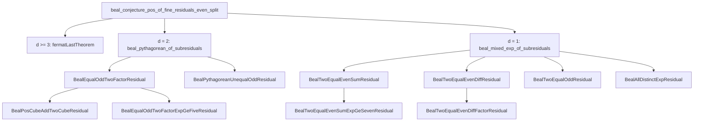

# DstDiophantine 研究優先度ランキング

調査日: 2026-09-19。基準は Lean 実装（論文草稿と食い違う場合は **Lean が正**）。`sorry` / `admit` による穴はなく、未完了は名前付き `Prop`（Residual / Bridge）と明示 `axiom` 4 本で管理されている。

この文書は「比較的容易に研究が進みそうな部分」を、主要定理への寄与と切り分けて評価したものである。有限 `native_decide` 証書や回帰整備は着手しやすいが、それだけでは live residual は閉じない。

---

## 1. 結論

**次の一手として最も費用対効果が高いのは、`BealPosCubeAddTwoCubeResidual` の局所 obstruction（mod / 2-adic）である。** 組立定理は既に揃っており、Mordell 曲線の rank を待たずに `d = 2` equal-odd 枝を前進できる。

同点級の基盤作業は [`DstDiophantine/Algebra/Generators.lean`](DstDiophantine/Algebra/Generators.lean) の Lorentz 内部 commutator 表である。機械計算で閉じやすく、[`Theorems/FermatMixed.lean`](DstDiophantine/Theorems/FermatMixed.lean) の sandwich 攻撃の前提になる。

使い分け:

| 目的 | 着手すべき候補 | 総合順位 |
| --- | --- | ---: |
| Beal の正値組立を 1 葉でも前進させる | `BealPosCubeAddTwoCubeResidual` の局所 obstruction | 1 |
| 代数コアを短期間で厚くする | Generators 内部括弧表 | 2 |
| 低リスクの並行作業 | Motor / 回帰 / 有限証書 | 3–5 |
| Beal `d = 1` even の本体 | even-diff 因子分解、ついで even-sum `z ≥ 7` | 6–7 |
| FLT の live 経路 | `FermatMixedMotorResidual`（代数橋の後） | 10 |
| 避ける（短期） | 旧 coarse / single-axis bridge の再利用、Mordell rank、axiom の内部証明、Goldbach 高さモデル | 下位 |

総合 1 位は「容易さだけ」でも「価値だけ」でもなく、**既存補題が厚く、組立先が証明済みで、外部大定理に依存しない**点で選んでいる。

---

## 2. 評価法

各候補を 1–5 点で採点し、次の重みで総合点（最大 80）を出す。

| 軸 | 略号 | 重み | 5 の意味 |
| --- | --- | ---: | --- |
| 研究価値 | V | ×4 | live residual / 主要定理への直接寄与 |
| 証明・実装容易性 | E | ×4 | 既存 API・mathlib で短く閉じられる |
| 波及効果 | I | ×3 | 下流の組立・他問題の解錠 |
| 外部ブロッカーの少なさ | B | ×3 | Wiles / Selmer / 未整備 Lie 同型などに依存しない |
| 検証容易性 | T | ×2 | `native_decide` / `example` / CI で確認しやすい |

\[
\text{総合} = 4V + 4E + 3I + 3B + 2T
\]

同点は **V が高い方**、さらに同点なら **I が高い方** を上位とする。

補助指標（本文の表では参考）:

- **主要前進** \(= 4V + 3I\)（容易さに引きずられない）
- **Quick Win** \(= 4E + 2T\)（短期着手しやすさ）

有限探索は Quick Win が高くても、モジュール自身が「residual 本体は閉じない」と書いているため、総合では中位に置く。

---

## 3. 現状（評価の前提）

### 3.1 三層プログラム

[`README.md`](README.md) と [`DstDiophantine/Framework/Amplification.lean`](DstDiophantine/Framework/Amplification.lean) の共有構造:

| 層 | 内容 | 状態 |
| --- | --- | --- |
| 1 Faithful encoding | 整数 → rotor / null translator。べき和 ↔ `powerSumMotor = 1` | 証明済 |
| 2 Amplification no-go | 許容界 \(\|J_{\mathrm{norm}}\| \le 1\) の下での増幅矛盾（問題非依存） | 証明済 |
| 3 Bridge / Residual | 古典解 ⇒ witness、または case split 後の残差 | **未完了（本丸）** |

無条件の Fermat / Beal / abc / RH / Goldbach / Polignac / Collatz は主張していない。

### 3.2 明示 axiom（4 本）

| 宣言 | ファイル | 役割 |
| --- | --- | --- |
| `fermatLastTheorem` | [`Theorems/FermatLast.lean`](DstDiophantine/Theorems/FermatLast.lean) | `bealExpGcd ≥ 3` など |
| `mihailescu` | [`Theorems/Mihailescu.lean`](DstDiophantine/Theorems/Mihailescu.lean) | 正値 `\|A\| = 1` |
| `darmonMerelCube` | [`Theorems/DarmonMerel.lean`](DstDiophantine/Theorems/DarmonMerel.lean) | even-sum `z = 3` |
| `fermatSignatureNN5` | [`Theorems/FermatNN5.lean`](DstDiophantine/Theorems/FermatNN5.lean) | even-sum `z = 5` |

### 3.3 正値 Beal の組立（証明済）・未閉 leaf

組立は [`beal_conjecture_pos_of_fine_residuals_even_split`](DstDiophantine/Theorems/BealEven.lean) まで閉じている。未閉なのは leaf の `Prop` である。

D4L アトラス [`Logic/Example/BealRegime.lean`](DstDiophantine/Logic/Example/BealRegime.lean) の `bealAtlasStatuses` では、閉じた slice が `.T`、diagnostic が `.F`、live residual が `.U` である。live は Mordell、`e ≥ 5`、even-diff、even-sum `z ≥ 7`、odd two-equal、all-distinct、unequal-odd、および Beal 本体。

### 3.4 Fermat の live 経路

単軸 modular / coarse discrete bridge は **diagnostic**（[`FermatCoarseDiscreteBridge`](DstDiophantine/Theorems/Fermat.lean) は vacuous）。live は dual-axis の [`FermatMixedMotorResidual`](DstDiophantine/Theorems/FermatMixed.lean)。`isMixedFermatMotor_of_sol` まで証明済。motor / sandwich との接続定理は未建設。

### 3.5 並行トラック

[`Basic.lean`](DstDiophantine/Basic.lean) は Gravity / Logic / CGA を re-export しない。Diophantine 主経路の短期優先度では下位に置く。

---

## 4. 総合ランキング

| 順位 | 候補 | V | E | I | B | T | 総合 | 主要前進 | Quick Win |
| ---: | --- | ---: | ---: | ---: | ---: | ---: | ---: | ---: | ---: |
| 1 | `BealPosCubeAddTwoCubeResidual` 局所 obstruction | 4 | 4 | 5 | 4 | 5 | **69** | 31 | 26 |
| 2 | Generators 内部 commutator 表 | 3 | 5 | 4 | 5 | 5 | **69** | 24 | 30 |
| 3 | Motor / Sandwich 回帰と全軸スカラー可換 | 3 | 5 | 3 | 5 | 5 | **66** | 21 | 30 |
| 4 | FoundationRegression / BealRegime 整備 | 2 | 5 | 3 | 5 | 5 | **62** | 17 | 30 |
| 5 | 有限 Beal 証書の境界拡大 | 2 | 5 | 2 | 5 | 5 | **59** | 14 | 30 |
| 6 | even-diff 因子 / 完全冪 residual | 4 | 3 | 4 | 3 | 3 | **55** | 28 | 18 |
| 7 | `BealTwoEqualEvenSumExpGeSevenResidual` | 5 | 2 | 5 | 2 | 2 | **53** | 35 | 12 |
| 8 | `BealEqualOddTwoFactorExpGeFiveResidual` | 4 | 2 | 4 | 3 | 3 | **51** | 28 | 14 |
| 9 | odd two-equal / all-distinct | 4 | 2 | 5 | 2 | 2 | **49** | 31 | 12 |
| 10 | `FermatMixedMotorResidual` | 5 | 2 | 3 | 2 | 2 | **47** | 29 | 12 |
| 11 | axiom の内部置換 | 5 | 1 | 5 | 1 | 1 | **44** | 35 | 6 |
| 12 | RelativeRotor 一般因子分解 | 3 | 2 | 3 | 3 | 3 | **44** | 21 | 14 |
| 13 | `BealPythagoreanUnequalOddResidual` | 3 | 2 | 3 | 2 | 3 | **41** | 21 | 14 |
| 14 | D4L / 量子スピノル残ギャップ | 3 | 2 | 2 | 3 | 3 | **41** | 18 | 14 |
| 15 | `BealMordellCubeAddTwoResidual` | 4 | 1 | 4 | 1 | 2 | **39** | 28 | 6 |
| 16 | `AbcModularBridge` | 3 | 2 | 2 | 2 | 3 | **38** | 18 | 14 |
| 17 | Gravity / PGA–TEGR 導出 | 3 | 2 | 2 | 2 | 3 | **38** | 18 | 14 |
| 18 | 他予想の `*AdmissibleBridge` | 2 | 3 | 1 | 2 | 4 | **37** | 11 | 20 |
| 19 | `BealModularBridge` / CGA dilation no-go | 4 | 1 | 3 | 1 | 2 | **36** | 25 | 6 |

**読み方:** 7 位の even-sum `z ≥ 7` は主要前進が最高級（35）だが容易性が低い。5 位の有限証書は Quick Win 最高級だが主要前進は低い。短期研究は 1–6 位を主戦場にし、7 位以降は準備が揃ってからでよい。

---

## 5. 候補別評価

### 1 位: `BealPosCubeAddTwoCubeResidual` の局所 obstruction

- **対象:** [`Theorems/BealGaussianCube.lean`](DstDiophantine/Theorems/BealGaussianCube.lean) の `BealPosCubeAddTwoCubeResidual`（正の \(\alpha^3 + 2\beta^3 = \gamma^3\) 禁止）
- **既存:** `pos_cube_add_two_cube_halve_of_even`、`not_even_alpha_odd_beta_pos_cube`、`nat_cube_mod_seven` / `nat_cube_mod_nine` と禁止スライス、有限証書 `no_pos_cube_add_two_primitive_of_le_hundredtwenty`（α, β ≤ 120）
- **組立先:** `BealEqualOddTwoFactorResidual_of_pos_cube_and_ge_five` → `BealEqualOddTwoFactorResidual` → `beal_pythagorean_of_subresiduals`
- **次の作業:**
  1. `nat_cube_mod_seven` と同型で mod 13 / 19 などの立方剰余表を追加し、禁止ペアを合成する
  2. 2-adic: 両方偶数なら halved が再び解、even-α/odd-β は既に不可能、という分岐を「原始的スライスへ帰着」まで一本化する
  3. 有限探索を 120 超へ拡大して回帰に載せる（本体証明の代替にはしない）
- **期待成果:** `e = 3` の two-factor 枝を、Mordell rank なしで部分閉包または強い局所 no-go にする
- **難所:** 方程式全体の無限族を mod だけでは閉じきれない。閉じきるには Affine / Mordell 経路（15 位）が残る
- **なぜ 1 位か:** V・I が高く、E・T も高い。組立は証明済。外部ブロッカーが Mordell を避けられる

### 2 位: Generators の Lorentz 内部 commutator 表

- **対象:** [`Algebra/Generators.lean`](DstDiophantine/Algebra/Generators.lean)
- **証明済:** 平方・reverse、同一軸 `[B⁺_a, B⁻_a] = 0`（`commutator_hyperbolic_cyclic_same`）、異軸反例 `commutator_hyperbolic0_cyclic1_ne_zero`、Lorentz–null の完全表（`commutator_hyperbolic_null` / `commutator_cyclic_null`）と `nullSpan` への落下
- **意図的ギャップ（docstring）:** 6 生成子内部の完全 Lie 括弧表、`𝔰𝔬(3,1)` 同型、Poincaré 同型。`hyperbolic_smul_mul` は軸 0 のみ
- **次の作業:**
  1. `commutator_hyperbolic_hyperbolic`、`commutator_cyclic_cyclic`、一般の `commutator_hyperbolic_cyclic` を `fin_cases` で閉じる
  2. `hyperbolic_smul_mul` を `Fin 3` 全軸へ一般化
  3. [`Algebra.lean`](DstDiophantine/Algebra.lean) の回帰 `example` に内部表を追加
- **期待成果:** `RelativeRotor` / `Sandwich` / `FermatMixedMotorResidual` が参照できる括弧 API
- **難所:** 本格的な Lie 代数同型は mathlib 接続が必要で、ここではやらない（C 級）
- **同点処理:** 総合 69 で 1 位と並ぶが、V が低いため 2 位。Quick Win ではこちらが上

### 3 位: Motor / Sandwich 回帰と全軸スカラー可換

- **対象:** [`Algebra/Motor.lean`](DstDiophantine/Algebra/Motor.lean)、[`Algebra/Sandwich.lean`](DstDiophantine/Algebra/Sandwich.lean)
- **証明済:** 定義的分解 `motor = rotorTorsion * expTrans`、ユニタリ性、null 指数の 1 次打切り、BCH 2/3-jet（`motor_bch2_jet` / `motor_bch3_jet`）、一般不一致 `exists_omegaBiv_ne_motor`、`sandwich_pureBoost_expTrans`
- **未主張:** 混合 torsion+translation の閉じた積法則、退化二次形式の完全 sandwich 等長、一般の `exp(Ω_usual+Ω_dual) = exp(Ω_usual)exp(Ω_dual)`
- **次の作業:** 2 位で得た括弧表を Motor 側へ export、全軸スカラー可換、`Algebra.lean` / [`FoundationRegression.lean`](DstDiophantine/FoundationRegression.lean) への回帰追加。4-jet の一致検証または否定は任意
- **期待成果:** FLT mixed-motor 攻撃の安全網。Diophantine 葉は直接閉じない
- **難所:** 閉じた積法則や 4-jet に手を伸ばすと工数が跳ねる。短期は「表と回帰」に限定する

### 4 位: FoundationRegression / BealRegime 整備

- **対象:** [`FoundationRegression.lean`](DstDiophantine/FoundationRegression.lean)、[`Theorems/BealRegime.lean`](DstDiophantine/Theorems/BealRegime.lean) の `classifyBealExponents`
- **現状:** phase 7 系の `example` は厚い。`BealRegime` は `Basic` 非 export（意図的）
- **次の作業:** 1–3 位で増えた補題の回帰、アトラス原子と live residual の対応コメント整備、export 方針の文書化（無理に `Basic` へ入れない）
- **期待成果:** 残差を 1 つ閉じたときの `.U → .T` 更新が安全
- **限界:** 研究本体ではない。総合を押し上げすぎないよう V = 2

### 5 位: 有限 Beal 証書の境界拡大

- **対象:** [`Theorems/BealFinite.lean`](DstDiophantine/Theorems/BealFinite.lean)、[`Theorems/BealResidualSearch.lean`](DstDiophantine/Theorems/BealResidualSearch.lean)
- **現状:** coprime perfect-power 箱（例: 基底 ≤ 21・指数 3…6 など）、open-residual フィルタ `noOpenResidualBealPerfectPowerUpTo 60 6`、cube kernel ≤ 120
- **モジュール自身の警告:** residual 本体（`BealPosCubeAddTwoCubeResidual` 等）は **閉じない**
- **次の作業:** open-residual 箱と cube kernel の N を段階拡大し、soundness 定理はそのまま再利用する
- **期待成果:** 小さな反例の不在、CI 回帰。反例が出れば Beal 全体に影響する（その場合の情報量は大きい）
- **限界:** 無限命題の代替ではない。Quick Win 30 に対し主要前進 14

### 6 位: even-diff 因子 / 完全冪 residual

- **対象:** [`Theorems/BealEven.lean`](DstDiophantine/Theorems/BealEven.lean) の `BealTwoEqualEvenDiffFactorResidual`、`BealTwoEqualEvenDiffPerfectPowerResidual`
- **既存:** `beal_two_equal_even_diff_yz_progress` / `_xz_progress`、`exists_odd_pow_parts_of_diff_sum_mul_eq_pow_both_odd`、`diff_sum_mul_eq_pow_both_odd_gcd_padic`、`exists_odd_parts_pow_of_mul_eq_pow_gcd_two`
- **組立:** `BealTwoEqualEvenDiffFactorResidual_of_perfect_power` と `BealTwoEqualEvenDiffResidual_of_factor` は証明済
- **次の作業:** opposite-parity と both-odd を分け、`n = 4`（平方差）から no-go を足す。DST bridge は不要
- **期待成果:** `BealTwoEqualEvenDiffResidual` の部分閉包、ひいては `d = 1` even の半分
- **難所:** 一般の `D·E = A^x` 降下は Fermat 型に戻りうる。小さな `n` に切るのが現実的

### 7 位: `BealTwoEqualEvenSumExpGeSevenResidual`

- **対象:** [`Theorems/BealEven.lean`](DstDiophantine/Theorems/BealEven.lean) の `BealTwoEqualEvenSumExpGeSevenResidual`。even-sum の **唯一の live 本体**（`z = 3` は Darmon–Merel axiom、`z = 5` は `(n,n,5)` axiom）
- **既存:** `beal_two_equal_even_sum_gaussian`、`exists_gaussian_hyp_pow_of_two_equal_xy_even`、組立 `BealTwoEqualEvenSumResidual_of_ge_seven`
- **次の作業:** Gaussian 斜辺冪の UFD を使い、`z = 7` など小さい奇数へさらに切る。一般 `z` を一度に狙わない
- **期待成果:** even-sum 全体の閉包（条件付き Beal の最大ピースの一つ）
- **難所:** 深い数論。Frey 型は新たな axiom 契約なしに持ち込まない。主要前進 35 だが E = 2 のため総合 7 位

### 8 位: `BealEqualOddTwoFactorExpGeFiveResidual`

- **対象:** [`BealGaussianCube.lean`](DstDiophantine/Theorems/BealGaussianCube.lean) の equal-odd、`e ≥ 5`、`1 < u`
- **既存:** `|u| = 1` は Mihăilescu で全奇数 `e ≥ 3` が閉。Gaussian hypotenuse power API
- **組立:** 1 位の cube residual と合わせて `BealEqualOddTwoFactorResidual`
- **次の作業:** 1 位と独立に攻撃可能だが、全体閉包には両方必要。小さな `u` や固定 `e` から切る
- **難所:** cube より前処理が薄い

### 9 位: `BealTwoEqualOddResidual` / `BealAllDistinctExpResidual`

- **対象:** [`Theorems/BealMixed.lean`](DstDiophantine/Theorems/BealMixed.lean)
- **既存:** `beal_expGcd_eq_one_two_equal_or_all_distinct`、`beal_mixed_exp_of_subresiduals`（組立済）、mod 4 の `beal_two_equal_xy_even_not_both_odd`
- **波及:** 閉じれば `BealMixedExpResidual` の残り（even 以外）が揃う
- **難所:** all-distinct は一般混指数。even 枝（6–7 位）より前処理が少ない

### 10 位: `FermatMixedMotorResidual`

- **対象:** [`Theorems/FermatMixed.lean`](DstDiophantine/Theorems/FermatMixed.lean)、[`Embedding/FermatMotor.lean`](DstDiophantine/Embedding/FermatMotor.lean)
- **証明済:** `n = 2` は純 cyclic、`n ≥ 3` 正値解は mixed（`isMixedFermatMotor_of_sol`）。条件付き FLT は `FermatLastTheorem_of_mixed_motor_residual`
- **攻撃点（doc）:** null translator 上の sandwich defect、`interfere axis0Boost axis1Rotation ≠ 0`（[`Logic/Geometric.lean`](DstDiophantine/Logic/Geometric.lean)、Beal even 診断では使用済）
- **次の作業:** 2–3 位の括弧表・`sandwich_pureBoost_expTrans` から、Fermat motor を null translator に接続する補題を先に書く。高さ増幅と単軸 winding は使わない
- **難所:** 接続定理が未記述。研究価値は高いが、代数橋なしでは進まない。総合 10 位、主要前進は 29 で上位群

### 11 位: axiom の内部置換

Wiles FLT、Mihăilescu、Darmon–Merel、`(n,n,5)` を Lean 内で証明する作業。価値と波及は最大級だが、このリポジトリの短期研究対象ではない。明示 `axiom` のまま組立を進める方が誠実である。

### 12 位: RelativeRotor 一般因子分解

[`Algebra/RelativeRotor.lean`](DstDiophantine/Algebra/RelativeRotor.lean)。同一軸可換と論文の無制限可換の反例（`paper_unrestricted_commutator_false`）は済。一般 3 軸の `exp(ω_usual+ω_dual) = exp(ω_usual)exp(ω_dual)` は未請求。2 位の括弧表の後なら部分的に触れる。

### 13 位: `BealPythagoreanUnequalOddResidual`

[`BealMixed.lean`](DstDiophantine/Theorems/BealMixed.lean)。`d = 2` で fourth-div と equal-odd の外側。fourth-div スライスは既閉。equal-odd（1 位・8 位）を先に進めたあとの仕上げ。

### 14 位: D4L / 量子スピノル残ギャップ

[`Logic.lean`](DstDiophantine/Logic.lean) 系。Beal アトラスは研究計画の可視化として有用（4 位と接続）。[`LeftIdealDim.lean`](DstDiophantine/Logic/Quantum/LeftIdealDim.lean) は 8 次元まで示し既約性は未請求。Diophantine 主 API からは切り離されている。

### 15 位: `BealMordellCubeAddTwoResidual`

[`BealGaussianCube.lean`](DstDiophantine/Theorems/BealGaussianCube.lean)。`y² = x³ - 1728` の有理点が 2-torsion のみ、という主張。Affine 経由で 1 位の cube residual を完全に閉じる経路。mathlib に Mordell rank はなく、Selmer 相当は外部。1 位の局所 obstruction の **代替本丸** であり、短期には後回し。

### 16 位: `AbcModularBridge`

[`Theorems/Abc.lean`](DstDiophantine/Theorems/Abc.lean)。連続 bridge は `AbcAdmissibleBridge_false` で否定済。live は modular。残ギャップは conformal / CGA gauge 対 PGA real-scale（FLT と同型）。Beal の window winding 転用は試金石だが、Beal leaf より優先しない。

### 17 位: Gravity / PGA–TEGR

[`Gravity.lean`](DstDiophantine/Gravity.lean)。チャート層の辞書・反例（`J` と teleparallel `T` の naive 同一化拒否）は厚い。`dst_derives_G` 等は明示的にない。Diophantine と独立。

### 18 位: 他予想の `*AdmissibleBridge`

Goldbach / Polignac / Collatz / Riemann。有限証書は既にある（Goldbach 偶数 ≤ 100、Polignac gap ≤ 30、Collatz `n ≤ 20`、Riemann 分母 ≤ 20）。Goldbach は `integerHeight` が分解と無関係とファイル先頭が明記しており、bridge 仮説の物理的妥当性が未検証。証書拡大は Quick Win だが主経路ではない。

### 19 位: `BealModularBridge` / CGA dilation no-go

[`Theorems/Beal.lean`](DstDiophantine/Theorems/Beal.lean) の `BealAdmissibleBridge`、`BealModularBridge`、`BealWindingBridge`、`BealCGADilationNoGo`。exponent-gcd 還元の方が live であり、幾何原理としての独立 CGA no-go は未証明。旧経路への再投資は優先度最低。

---

## 6. 推奨ロードマップ

### Phase I（短期: 1–2 スプリント）

1. **1 位** cube の mod 13/19 と 2-adic 原始スライスへの一本化
2. **2 位** Generators 内部括弧表（`fin_cases`）
3. **3–4 位** を並行: Motor export・回帰、`FoundationRegression` に新補題を載せる
4. **5 位** は計算資源の空きで cube kernel / open-residual 箱を拡大（本体の代替にしない）

### Phase II（中期: Beal `d = 1` even と `d = 2` equal-odd）

5. **6 位** even-diff の `n = 4` および opposite-parity の部分 no-go
6. **8 位** は 1 位と合流させ `BealEqualOddTwoFactorResidual` を目指す
7. **7 位** even-sum は `z = 7` などへ切ってから本体に触れる

### Phase III（長期）

8. odd / all-distinct、unequal-odd
9. 2–3 位完了後の `FermatMixedMotorResidual`
10. Mordell、abc modular、他予想 bridge、Gravity 変分同値は外部結果または別トラック

---

## 7. 避けるべき経路と注意点

1. **有限証書を残差閉包と読まない。** [`BealResidualSearch.lean`](DstDiophantine/Theorems/BealResidualSearch.lean) 先頭が明示している。
2. **旧 coarse / 単軸 modular FLT を live に戻さない。** `CoarseAmplificationWitness.empty_of_coarse`、`FermatModularBridge` は diagnostic。
3. **論文の dagger 厳減・無制限可換・Killing 係数を再証明しようとしない。** すでに反例がある（`dagger_not_strict_descent`、`paper_unrestricted_commutator_false`、`paper_appendix_killing_coeff_false`）。
4. **Goldbach の `integerHeight` 増幅を古典予想の証明戦略に使わない。** 高さは分解の有無と独立。
5. **Motor を `exp(Ω_biv)` と同一視しない。** `exists_omegaBiv_ne_motor` が no-go。
6. **axiom を隠さない。** 置換は 11 位であり、短期の「証明したつもり」はリポジトリ方針に反する。
7. **Lean と TeX が食い違ったら Lean を正とする。**

---

## 8. 採点の補足（主要 6 候補の対比）

計画で特に比較するよう指定された 6 件:

| 候補 | 総合 | 主要前進 | Quick Win | 一言 |
| --- | ---: | ---: | ---: | --- |
| cube 局所 obstruction | 69 | 31 | 26 | 最短の Beal 葉 |
| Generators 内部表 | 69 | 24 | 30 | 最短の代数仕上げ |
| 有限証書 | 59 | 14 | 30 | 診断専用 |
| even-diff | 55 | 28 | 18 | 純数論で even の半分 |
| even-sum `z ≥ 7` | 53 | 35 | 12 | 最大ピースだが重い |
| `FermatMixedMotorResidual` | 47 | 29 | 12 | 代数橋が前提 |

「容易に進む」だけなら Generators / 回帰 / 有限証書が先頭になる。「研究として意味のある次の一手」なら cube 局所 obstruction が先頭、even-diff がそれに続く数論本体である。
