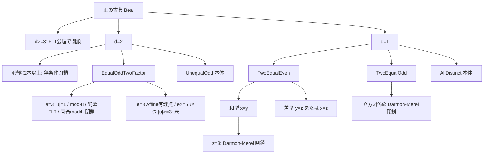

# PGA-DST ディオファントス証明基盤 — 研究計画

最終更新: 2026-08-23（弦→SM 再構成 Lean 切片: Cl91 / MW16 / LevelMatch）

## 0. いまの見通し

**北極星:** 細残件が閉じれば、FLT 公理のもとで正の古典 Beal（`bealGcd > 1`）が従う。無条件古典 Beal は主張しない。

**閉じたもの:** 加法忠実化・共通 no-go・旧 coarse 空性・modular 基盤。Beal は指数 gcd 三分法まで還元済み。組立 `beal_conjecture_pos_of_fine_residuals` / `_even_split` は sorry なし。公理は明示 3 本のみ（`fermatLastTheorem` / `mihailescu` / `darmonMerelCube`）。`sorry` は 0。

**Phase 7p 進捗:**
- D4L レジーム: `RegimeValuation.ofList` / `meetRList`；抽象ビール地図 `Logic/Example/BealRegime`（切片 T / 診断 F / book B / 残件 U）；`{切片} ⊭_T` 古典 Beal
- 証人 `Theorems/BealRegime`（Basic 非依存）: 実定理 ↔ ラベル；`isOpenResidualExponents ↔ U`；釣り合い種 ↔ `IsBalancedMassive` の薄いリンク
- 古典冪判定を底 ≤17・指数 3…6 まで拡大；正立方核 ≤60；開残件フィルタ ≤30

**Phase 7o 進捗:**
- 古典冪判定を底 ≤16・指数 3…6 まで拡大；正立方核 ≤50；開残件フィルタ ≤25
- 偶差因数核: 反対パリティで符号つき `x` 乗抽出；両奇で gcd=2・`v₂=1`・2-free 部が `x` 乗；包装残件 `BealTwoEqualEvenDiffPerfectPowerResidual` → Factor 組立
- Affine `X³+2Y³=1` を Mordell `y²=x³-1728` へ双有理包装（写像・恒等式・組立）。階数本体は未（mathlib に無し）。PLAN 旧ラベル `y²=x³-27` は誤りで、正しいモデルは `y²=x³-1728`

**Phase 7n 進捗:**
- 発見用ファインダ `findCoprimeBealUpTo` / `findCoprimeBealPerfectPowerUpTo`（健全性・完全性付き）
- 正立方核 `α³+2β³=γ³` の原始有限箱（底 ≤40・奇 α）を `BealResidualSearch` で閉鎖（残件本体ではない）
- 開残件フィルタ（`d∈{1,2}`、4| 二本スキップ、DM 立方位置スキップ）で冪判定 ≤20・指数 3…6
- 古典冪判定を底 ≤15・指数 3…6 まで拡大；非互素 witness `7³+7⁴=14³` / `2⁵+2⁵=2⁶` を追加

**Phase 7m 進捗:**
- 立方残件 `α³+2β³=γ³` を原始化・パリティ・差の因数（gcd|3）・2-進へ整形；有理点残件 `BealAffineCubeAddTwoResidual`（`X³+2Y³=1` の有理点は `(1,0),(-1,1)` のみ）から正方程式残件への組立を証明。素朴 2-進下降はこの方程式には使えない（符号つき解あり）
- equal-odd `|u|=1` を奇数 `e≥3` へ一般化し Mihăilescu で閉鎖；`e≥5` 残件は `1 < u`（`|u|≥3`）に狭め
- 偶差因数核に `gcd(|D|,|E|)∣2`・反対パリティで gcd=1・両奇で gcd=2・2-進付値の一方が 1、の補題を追加
- 冪判定有限箱を底 ≤14・指数 3…6 まで拡大（反例なし）→ 7n で ≤15 → 7o で ≤16 → 7p で ≤17

**開いているもの:** Mordell `y²=x³-1728` の階数（mathlib に無い）、`BealEqualOddTwoFactorExpGeFiveResidual`（`|u|≥3`）、偶差完全冪の一般 Fermat 下降本体、和型 z=5/≥7、Odd / AllDistinct / UnequalOdd。Fermat/abc modular bridge 本体。D4L L2–L3。Gravity 一般モーター辞書。

**実行原則:** デフォルトの作業は残件本体の正面突破ではない。切片・有限証明書・診断定理で成果を出し、アイデアが立ったときだけ本体へ戻る。

---

## 1. 三層アーキテクチャ

PGA-DST による証明手法を、次の三層に分離する。未証明の bridge を一般定理と混同しない。


| 層 | 役割 | 状態 | 主な場所 |
|----|------|------|----------|
| **加法忠実化** | 冪和型方程式 ↔ `powerSumMotor = 1` | 証明済み | `Framework/Representation`, `Embedding/NullTranslator` |
| **共通 no-go** | `k` 倍増幅 vs 許容有界性 / 粗格子下限 | 証明済み（高さ版） | `Framework/Amplification`, `Algebra/Amplification` |
| **問題別 bridge** | 整数解 ⇒ 増幅証明書 | **未証明**（旧 coarse は構造的空；modular は型付け済） | 各 `Theorems/*.lean` の `*Bridge` |
| **modular 増幅** | `ZMod` 倍写と巻数誤差 | **基盤＋巻数/実スケールギャップ証明済** | `Algebra/ModularAmplification` |
| **1D CGA 探針** | 乗法 dilation / 斉次 null 点 | **診断層（Basic 非依存）** | `Algebra/CGA`, `Embedding/ConformalInteger` |

### 確立済み（機械検証済み・sorry なし）

- PGA / Cl(3,1) / ヌル強消滅 / 定義積モーター `M:=RT` の単位性
- 許容配置上の `|JNormalized| ≤ 1`（naive 全配置有界性は**反例付きで棄却**）
- 離散鋭い上界・粗トーラス高さ no-go・旧 `CoarseAmplificationWitness` の構造的空性
- 加法 null 忠実性（Fermat / Beal / abc / Goldbach / Polignac の骨格）
- modular 巻数恒等式・実スケール許容 ⇒ `windingTotal = 0`
- `FermatModularBridge` / `BealModularBridge` / `AbcModularBridge` の型付けと条件付き古典主張
- Beal: 指数 gcd 還元・無条件スライス・FLT 公理で `d≥3`・Gaussian UFD・細残件組立・Darmon–Merel 3位置・偶分割・立方切片・有限箱／冪判定
- 1D CGA・有限計算証明書（Collatz / Goldbach / abc / RH / Polignac）・D4L L1・Gravity チャート

### 未証明 Bridge（診断・空・本命）

| Bridge | 印 | 備考 |
|--------|----|------|
| `FermatModularBridge` | **本命・未証明** | 共形ギャップ；診断 `FermatAdmissibleBridge` は釣り合いで偽になり得る（`false` 定理は P0） |
| `FermatCoarseDiscreteBridge` | 空 | legacy；payload 構造的空 |
| `BealCGARealization` / `BealCGADiscreteClosed` | bookkeeping | 幾何原理ではない（≡ `|A|=1` 系） |
| `BealUnitBaseNoGo`（正） | 切片閉鎖 | Mihăilescu 公理 |
| 細残件 5 本 | **本命・未証明** | 組立に必要な仮説；切片は下記地図 |
| `BealWindingBridge` | 診断 | 窓場合は証明済；釣り合いは空 |
| `BealModularBridge` | 診断 | payload 矛盾を機械検証 |
| `AbcModularBridge` | **本命・未証明** | 連続版は `AbcAdmissibleBridge_false` |
| Collatz / Goldbach / Polignac / RH `*AdmissibleBridge` | 別系列 | 有限箱のみ証明済 |

### 反例で棄却済み（再設計しない）

- 主枝のみでの `|J| ≤ 1`、dagger 厳密減少、現行連続 FLT 閾値、許容錐への単純折り返し
- 実スケール粗離散 witness、duality による null bivector 閉性、`so(3,1)⊕so(3,1)`
- Gravity: 素朴な `J`/`J5`/`J_field=½T` 同一視；`conjectured_J_field_eq_half_T_plus_div`（TEGR カレント特殊化）

---

## 2. Beal 還元地図



**組立（sorry なし）:** `beal_conjecture_pos_of_fine_residuals`（5 残件）／`beal_conjecture_pos_of_fine_residuals_even_split`（Sum+Diff 版）。`beal_mixed_exp_of_subresiduals`・`beal_pythagorean_of_subresiduals`・`beal_two_equal_even_of_sum_diff`。`BealPosCubeAddTwoCubeResidual_of_affine`。`BealEqualOddTwoFactorResidual_of_pos_cube_and_ge_five`（`|u|=1` は Mihăilescu で全奇数 `e≥3` 閉鎖）。

| 残件 | 閉鎖切片 | 本体（未） | 主な場所 |
|------|----------|------------|----------|
| `BealTwoEqualEvenSumResidual` | `z=3`（DM）；`…_of_outside_cube`；`z=5`/`z≥7` 分割組立 | `z=5` と `z≥7` 本体 | `BealEven` |
| `BealTwoEqualEvenDiffResidual` | 因数分解 progress；`gcd∣2` / 2-進補題；完全冪抽出（反対パリティ・両奇）；`…_of_factor` / PerfectPower→Factor 組立 | 完全冪 ⇒ より小さい Fermat 段階 | `BealEven` |

| `BealTwoEqualOddResidual` | 立方 3 位置（DM） | 立方以外 | `BealMixed` / `DarmonMerel` |
| `BealAllDistinctExpResidual` | なし | 全相異 | `BealMixed` |
| `BealEqualOddTwoFactorResidual` | `|·|=1`（全奇数 `e≥3`）/ mod-8 / 純冪 FLT / 両奇 mod-4；**e=3→正立方＋Affine 組立**；**Affine←Mordell `y²=x³-1728` 組立**；`e≥5` は `1<u` に狭め | Mordell 階数；`e≥5` かつ `|u|≥3` | `BealGaussian` / `BealGaussianCube` |

| `BealPythagoreanUnequalOddResidual` | なし（4 整除は残件外で無条件閉鎖） | unequal-odd | `BealMixed` |

公理（Lean 証明ではない）: `fermatLastTheorem`・`mihailescu`・`darmonMerelCube`。

---

## 3. 実行優先度（成果しやすさ順）

### P0 — すぐ閉じる（次サイクルの既定）

- **Mordell `y²=x³-1728` 階数 / `BealMordellCubeAddTwoResidual`**: Affine 組立は 7o で済。閉じれば正立方残件が従う。mathlib に階数は無い。有限切片: 原始正解は底 ≤60 で無し（7p）。
- **偶差完全冪の一般 Fermat 下降**: 抽出・Factor 組立は 7o で済；`±u^x ± v^x = 2 C^k` 本体は未。
- **有限証明書の一段拡大**: 冪判定は底 ≤17・指数 3…6（7p）。次は底 18 または指数 7；`native_decide` 不成立なら上限を戻し本節に記録。開残件フィルタは底 ≤30 まで。
- **偶二一致和型**: `z=3` 済、`z=5`/`≥7` 分割済。固定 `z` に古典定理があれば公理化（`(n,n,5)` の完全定理化はしない）。

### P1 — 設計は要るが閉塞していない

- **D4L L2 モーター命題**（新規モジュール）。L3 `BalancedResidualClass` は釣り合い種の薄いリンク（7p）のあと。
- **ローカル論文同期**: `papers/dst-diophantine.tex` と Lean 境界。GitHub `dual-spacetime-doc` とフォルダに無い RH / Langlands は据え置き。
- **偶二一致差型の形の固定**（`BealEven`）: `C^n − B^n = A^x` の補題整理まで。

### P2 — 本命だが重い（切片のアイデアが立ったときだけ）

- 残件本体: Sum の `z≠3`、Diff 全体、Odd（立方外）、AllDistinct、EqualOdd（`|u|≥3` / `e≥5`）、UnequalOdd。
- `FermatModularBridge` / `AbcModularBridge` 本体（`ConformalGaugeAdmissible`）。
- Gravity 一般モーターの修正辞書；D4L L3 `BalancedResidualClass`（薄いリンクは 7p 済；専用モジュールは未）。

### P3 — 据え置き / 再設計しない

無条件古典 Beal、TEGR↔EH 変分、時空 CGA、mathlib PGA contrib、旧 coarse / 連続 FLT bridge / dagger、GitHub 側 RH・Langlands・particle-stability・IUT（フォルダに無い）。

### 問題類型（再利用パターン）

| 類型 | 代表 | 次の数学課題 |
|------|------|--------------|
| **冪和増幅型** | FLT, Beal | 解 ⇒ modular witness / 残件本体 |
| **品質型** | abc | 高品質 ⇒ modular / 許容配置 |
| **軌道型 / 加法分解型 / 解析型** | Collatz, Goldbach, Polignac, RH | 別系列；有限箱は P0 |

---

## 4. 成功判定（次サイクル）

- [x] `BealPosCubeAddTwoCubeResidual_of_affine` が閉じる、**または** 偶差核に `gcd∣2` / 2-進の新補題がある（7m: 両方）
- [x] equal-odd `|u|=1` がすべての奇数 `e≥3` で閉じている
- [x] Beal 冪判定が底 ≤14 または指数 ≤7 に一段上がっている（底 ≤14・指数 3…6）
- [x] Phase 7n: ファインダ API・正立方核有限箱 ≤40・開残件フィルタ ≤20・冪判定 ≤15
- [x] Phase 7o: 冪判定 ≤16・立方核 ≤50・開残件 ≤25；偶差完全冪抽出＋Factor 組立；Affine←Mordell `y²=x³-1728` 包装
- [x] Phase 7p: D4L ビール残件地図（`{切片} ⊭_T`）；証人 `BealRegime`；冪判定 ≤17・立方核 ≤60・開残件 ≤30；`isOpenResidual ↔ U`
- [x] 無条件古典 Beal を主張していない

---

## 5. モジュール地図（現行）

```
Algebra.lean             ← DST 代数コアのバレル（Theorems / Gravity 非依存）
Algebra/
  Admissible             ← IsPrincipalBranch / IsAdmissibleContinuous（パラメータ辞書）
  QuadraticForm, PGA, Cl31, Generators, Operations, Motor, Invariant
  Discrete, Continuum, UnitGroup
  Amplification          ← pureBoost / 実スケール
  ModularAmplification   ← ZMod 倍写・巻数・非空 witness・共形ギャップラベル
  Sandwich               ← 共役 `m v m̃`・純ブースト成分・光円錐固有値
  CGA/                   ← 1D Cl(2,1) 探針（Basic 非依存）
Gravity/                 ← PGA–TEGR チャート層（数論経路とは独立）
  Coframe, Sandwich（チャート尺度橋）, Schwarzschild, Weitzenbock,
  Tetrad（モーター誘起フレーム）, Identification（辞書・棄却）
Framework/
  Representation, Lattice, Amplification, Descent, Search
Embedding/               ← R(n), T(a), Height, quantizeInt / quantizeMismatch
  ConformalInteger       ← CGA null 点埋め込み（診断）
Theorems/
  Fermat                 ← FermatModularBridge + legacy / 連続診断
  Beal (exp-gcd 還元 + Realization bookkeeping + 混合指数切り出し),
  BealSlice (無条件 FLT n=3,4 スライス + 双二次),
  BealPythagorean (d=2 UFD / DiffFourth / 4 整除 2 本以上),
  BealGaussian (ℤ[i] UFD / equal-odd / 偶二一致進捗),
  BealMixed (細残件組立 / Gaussian 偶持ち上げ / Darmon–Merel 適用),
  BealEven (偶二一致 和型／差型分割),
  BealGaussianCube (equal-odd e=3 切片 + Affine↔Mordell 包装),
  BealFinite (有限箱 + 冪判定 + ファインダ), BealResidualSearch (立方核 / 開残件フィルタ),
  BealRegime (Phase 7p: D4L 証人；Basic 非依存),
  DarmonMerel / FermatLast / Mihailescu (公理),
  Abc (AbcModularBridge + continuous false), Collatz, Goldbach, Polignac, Riemann
Basic.lean / FoundationRegression.lean
Gravity.lean / CGA.lean / Logic.lean  ← 並列入口（Basic には強制 import しない）
Logic/                   ← D4L（振幅、JNormalized の四状態、質量／真空／釣り合い、幾何演算、
                           構文、指定値、帰結、レジーム、離散振幅、増幅力学、巻数二測定）
Logic/Example/           ← 2値が担えない例（固定点、非爆発、Jnorm<1、レジーム、Beal残件地図）
Logic/Quantum/           ← D4L 双対 Hilbert 層: 分離、双対扇、四元数、C2、部分空間格子、辞書、
                           弦比較（Cl91 / MW16 / スペクトル標識 / レベルマッチ辞書 / 棄却）
```

### 並列トラック: 弦→SM 再構成（Basic 非依存）

仕様 [`DST-string theory.md`](DST-string theory.md) §3–4。Beal P0 は据え置き。

- `Algebra/Cl91`・`LorentzDim`・`Q91`: Cl(3,1)↪Cl(9,1)、実次元 16≠1024
- `Logic/Quantum/Spinor10`: MW16 ≃_ℝ WeylSU4（Spin 同変なし）
- `MinimalIdeal`: 作業用冪等元；論文 `(1±i)/2` は `i²=-1` で非冪等として棄却
- `LevelMatch`: `IsLevelMatched := J=0`；釣り合い配置
- `LorentzDim` / `StringSpectrum`: 8+8 ≠ 6（正本は `lightCone_ne_torsionGenerators`）
- `StringCompare`: 偽同一視の閉鎖。ヘテロティック格子対応は次サイクル
- 無条件に「DST が SM を導く」「3世代」とは主張しない

---

## 6. 完了アーカイブ

**基盤完了条件（達成済）:** `CoarseAmplificationWitness.empty_of_coarse`、modular witness inhabited、巻数／J 誤差恒等式、duality・motor・Lie ラベル境界、無条件予想を主張しない、`lake build`。

### フェーズ 0–6

環境、PGA コア、離散有界、整数埋め込み、条件付き 7 予想。Framework 抽出。釣り合い型で連続 bridge が破綻し得ることを機械検証。旧粗離散 witness の方程式非依存空性。

### フェーズ 7–7c

modular 再設計と巻数ギャップ（`admissible_scale_implies_windingTotal_eq_zero`）。`FermatModularBridge` / `AbcModularBridge` / 旧 `BealModularBridge` の型付け。Beal 窓巻数・payload 矛盾・主値窓。1D CGA 探針。

### フェーズ 7d–7f

CGA 冪格子／Realization を bookkeeping 化（幾何原理として使わない）。Mihăilescu 正 UnitBase。指数 gcd 還元と `bealExpGcd` 三分法の準備。

### フェーズ 7g–7k

無条件スライス（`BealSlice`）。`d=2` の 4 整除 2 本以上（`BealPythagorean`）。FLT 公理で `d≥3`。Gaussian UFD・equal-odd／偶二一致進捗（`BealGaussian`）。細残件組立（`BealMixed`）。Darmon–Merel 3位置。偶和／差分割（`BealEven`）。equal-odd `e=3` 切片（`BealGaussianCube`）。有限箱・冪判定（`BealFinite`）。

### フェーズ L1（D4L）

`mass` / `massNormalized`、`IsVacuum` / `IsBalancedMassive`。論文第6章の `J=0 ⇒` 自明を棄却。L2 モーター命題は後続。L4 ビール残件地図は Phase 7p で閉じた（`Logic/Example/BealRegime` + `Theorems/BealRegime`）。L3 `BalancedResidualClass` は薄いリンクのみ（専用モジュール未）。

### Gravity チャート

Schwarzschild 対角テトラッド、Weitzenböck、動径ブースト、モーター誘起フレーム、辞書分離。素朴同一視の棄却と `conjectured_J_field_eq_half_T_plus_div` の反証。TEGR↔EH は文献据え置き。一般モーター修正辞書は未決。

### modular 経路（診断図）

```
解 a^p+b^p=c^p ──► null translator = 1          （加法・証明済）
                ┄┄► quantizeMismatch 種
                         │
                         ▼
                ModularAmplificationWitness（解依存・未証明）
                         │ has_winding ⇒ ¬ 実スケール許容（証明済）
                         ▼
                ConformalGaugeAdmissible（残ギャップ）
                         ▼
                   条件付き FLT（fermat_last_theorem_of_modular_bridge）
```

---

## 7. DST / 離散論文へ返す欠点（2026-08-14）

Lean 代数コアの整理で機械検証した（または棄却した）論文側の問題。本体 `.tex` は https://github.com/hypernumbernet/dual-spacetime-doc。**同期先はリポジトリ内 `papers/`**（作業ツリーに `References/` フォルダは無い）。GitHub 本体へは未反映。フォルダに無い `dst-riemann-hypothesis.tex` / `dst-langlands-program.tex` / `dst-particle-stability.tex` / `dst-iut.tex` は未着手。

### 優先（`|J|≤1` を無条件に使っている）

| 論文 | 内容 | Lean |
|------|------|------|
| `dst-riemann-hypothesis.tex` | 要旨・§2 が `|J|≤1`。主枝だけでは偽。許容錐と `JNormalized` に置換 | `torsion_bound_naive_false` |
| `dst-langlands-program.tex` | 「Torsion Boundedness `|J|≤1`」を任意アンサンブルのマスター定理にし、Langlands 全体を従わせている。許容なしでは成り立たない。無条件主張は落とす | 同上 |

### 優先（生の J の有界の中身が食い違う）

| 論文 | 内容 | Lean |
|------|------|------|
| `double-spacetime-theory.tex` App.B | `Ω=∑(α/2)iΓ+(β/2)Γ` と `B(iΓ,iΓ)=8` なら `B(Ω,Ω)=2∑(α²-β²)`。付録の `8∑` は誤り | `paper_appendix_killing_coeff_false` |
| 同 App.B | `[iΓ_a,Γ_b]=0` は同軸のみ。異軸は反例 | `commutator_hyperbolic_cyclic_same` / `…_ne_zero` |
| 同 | `so(3,1)⊕so(3,1)` は次元 12。生成子は 6。Poincaré 候補が妥当 | `Generators` docstring |
| 同 §「J remains bounded」 | 許容＋`|J|≤3π²/8`（または `|JNormalized|≤1`）に限定 | `torsion_bound_raw_continuous_pi_sq` |
| `dst-quantum-gravity.tex` | `|J| ≤ J_max ~ N^{-2}` と `|J| ≤ c⁴/G ℓ_P^{-2}` が並立し、許容錐の `3π²/8` とも矛盾。離散 `ε_N=16/(3N²)` は非零高さの**下限**であり上界ではない | `discrete_nonzero_height_lb` |

### Jnorm 入りだが残件がある

| 論文 | 残件 | Lean |
|------|------|------|
| `discrete-dual-spacetime.tex` | 許容は離散化の帰結ではなく追加仮説。「整数環の有限単数群」は `DiscreteRotorImage`。「`A≲300`」は導出なし。双曲 rapidity のトーラス量子化は釣り合い型で巻数 0 | `torsion_bound_naive_false` / `discreteRotorImage_finite` / `beal_balanced_gap_no_modularWitness` |
| `dst-pga.tex` | `J⁵` 非有界の備考は既にある。残るのは `1/16 B` と生成子展開の係数、`motor=exp(Ω)` vs 定義積 `RT` | `J5_unbounded` / `Motor` |
| 局所 / GitHub `dst-diophantine.tex` | 第3章・付録は 2026-08-14 に等号 iff・離散鋭い上界・Killing `2∑` 注記へ同期した。GitHub 本体へ未反映 | `abs_JNormalized_eq_one_iff` / `torsion_bound_discrete_sharp` |

### J の定義が別物（範囲を流用しない）

| 論文 | 内容 |
|------|------|
| `dst-particle-stability.tex` | `J(ℓ,w,δφ)=½ m ℓ (δφ)²` は Killing の J ではない。`|JNormalized|≤1` を流用できない |
| `dst-iut.tex` | 数値上界は無いが `so(3,1)⊕so(3,1)` と `J=1/16 B` を引用。主論文の Killing 修正に追随 |
| `dst-dynamic-equation.tex` / `dst-de-broglie-wave.tex` | 位相・振動子として J を使う。`|J|≤1` は書いていない。辞書が固まったら引用を揃える程度 |

### 既出の非 J 範囲項目（維持）

| 項目 | 内容 | Lean |
|------|------|------|
| null dual 閉性 | grade で棄却 | `dual_null` |
| `motor = exp(Ω_biv)` | 非可換時は偽。定義積 `R·T` のみ | `Motor` |
| TEGR↔EH | 未証明の修正場辞書 + 文献引用。素朴な `J=½T` は棄却。変分なし | Gravity チャート切片 + 棄却 |
| 連続体否定 vs `∫J d⁴x` | 論理的緊張 | 形式化対象外 |
| `BealCGADiscreteClosed` | 幾何原理ではない（bookkeeping） | `beal_kFold_powerLattice_iff_natAbs_eq_one` |
| 文献プレースホルダ | `arXiv:xxxx.xxxxx` | — |

### Lean 境界（J 範囲・固定済）

- 軸ごと上界の等号 iff、生の天井 `|J|≤3π²/8`、`|JNormalized|=1` の大域等号、像 `[-1,1]`
- 離散 `|JNormalized| ≤ (4⌊N/4⌋/N)²`、`4∣N` で ±1、`¬4∣N` で厳密、許容離散値の稠密
- `Algebra.lean` / `Basic.lean` export と `FoundationRegression` の回帰 example

---

## 8. 次アクション

1. **（P0）** `BealMordellCubeAddTwoResidual`（`y²=x³-1728` 階数）または正立方残件のさらなる有限拡大
2. **（P0）** 偶差完全冪の一般 Fermat 下降；有限箱を底 18 または指数 7 へ
3. **（P1）** D4L L2 モーター命題；`papers/` と Lean 境界の同期
4. **（P2）** 残件本体（`e≥5`、Sum z=5/≥7、Odd、AllDistinct、UnequalOdd）・modular bridge 本体
5. **（P3）** 無条件古典 Beal／TEGR↔EH／時空 CGA／GitHub 側未同梱論文は据え置き

**最終目標（長期）:** 7 予想を「離散双対時空代数の内部で許容増幅証明書が存在しない」という単一原理から導く完全機械検証。現状は共通 no-go・modular 基盤・Beal 還元組立・切片・有限箱まで固めた段階であり、無条件古典 Beal は細残件本体が閉じるまで未達成である。FLT / Darmon–Merel / Mihăilescu 公理は mathlib 未形式化の古典定理の明示的仮定であり、それぞれの Lean 証明ではない。
